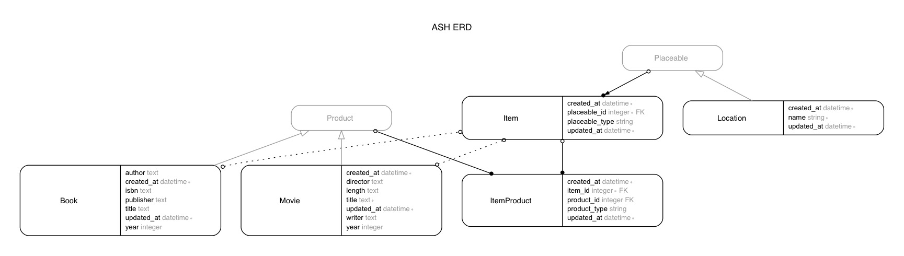
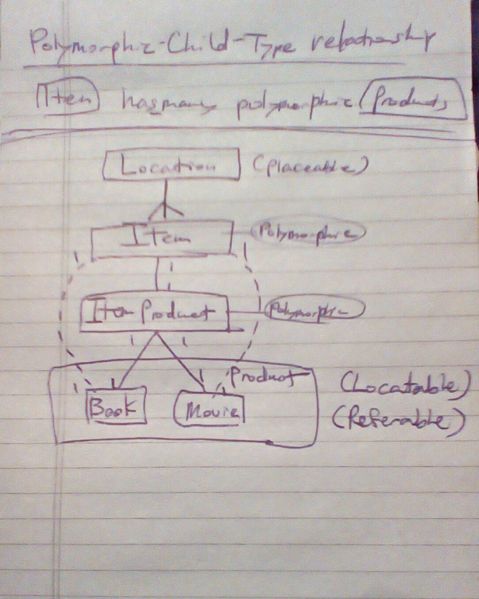

# has_one_through_polymorphic_relation

In this repo, I learn has one though polymorphic relation, following the article [Rails: Has One Through Polymorphic Relation](http://6ftdan.com/allyourdev/2016/03/22/rails-has-one-through-polymorphic-relation/) by DANIEL P. CLARK

## Polymorphic-child-type relation
- E.g., `:item` `has_many` `polymorphic` `:products`

